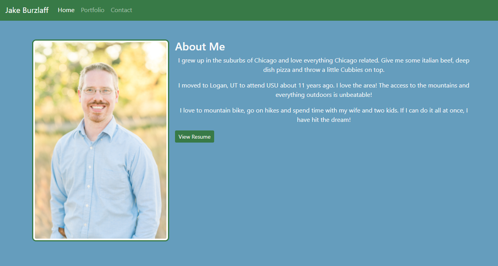
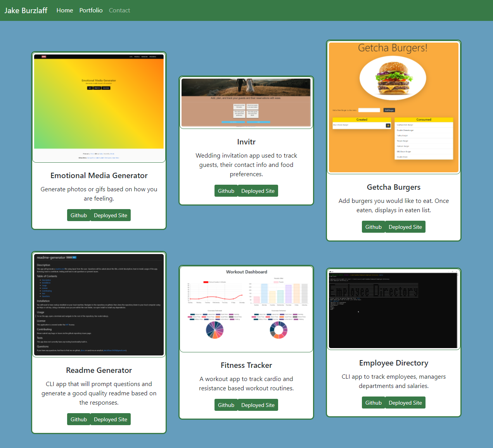
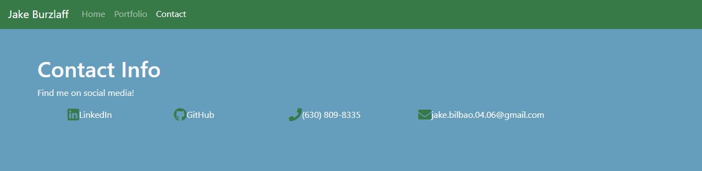

# My Portfolio

This is a website dedicated to my work as a developer.  In it you will find information about myself and the some of the projects that I have been working on developing.

Link to my [Portfolio](https://jburz.github.io)

## Languages / Frameworks / Packages
 - Javascript
 - React
 - react-bootstrap
 - react-router-dom

# Features
 - Responsive design to account for different screen sizes
 - Grid layout sytem via bootstrap using containers, rows and columns
 - React components 
 - Use of props to pass data to nested components

 ## Credits

 This website was created by [Jake Burzlaff](https://www.github.io/jburz).
